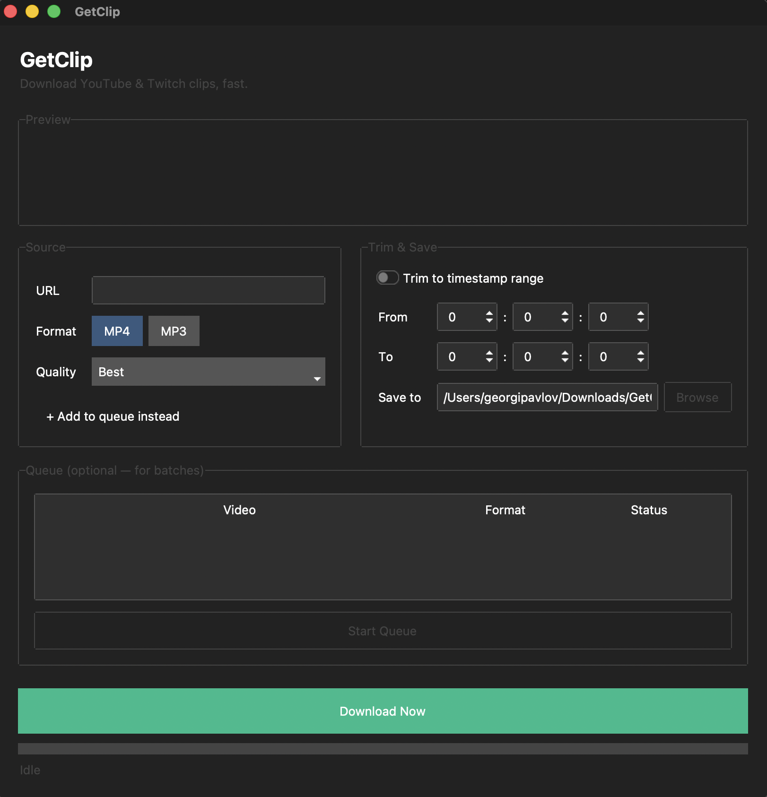

# GetClip

A simple desktop app for downloading YouTube videos and Twitch clips/VODs as MP4 or MP3 — with optional timestamp trimming, a live preview before you download, and a batch queue for grabbing multiple videos at once.




## Download

**macOS only for now.**

Grab the latest build from the [Releases page](https://github.com/GZPavlov23/getclip/releases) — unzip `GetClip.zip` and double-click `GetClip.app`. No Python or terminal required.

> Since this isn't signed with an Apple Developer certificate, the first time you open it you'll need to **right-click → Open → Open** to bypass Gatekeeper's warning.

## Features

- **YouTube videos and Twitch clips/VODs** — auto-detected from the pasted URL, with a contextual hint (e.g. trimming recommended for long VODs)
- **Live preview** — see the title and thumbnail before committing to a download
- **MP4 or MP3** output, with quality options for video
- **Timestamp trimming** — grab just the section you need instead of the whole video
- **Batch queue** — add several videos and download them one after another
- **Download Now** for quick one-off downloads, no queue required

## Running from source

If you'd rather run it with Python directly (e.g. to modify the code):

### Requirements
- Python 3.10+
- [ffmpeg](https://ffmpeg.org/download.html) installed and on your PATH

### Setup
```bash
git clone https://github.com/GZPavlov23/getclip.git
cd getclip
python3 -m venv venv
source venv/bin/activate
pip install -r requirements.txt
python3 main.py
```

### Building the app yourself
```bash
./build.sh
```
This produces `dist/GetClip.app`.

## Project structure

This project follows a simple three-layer architecture: