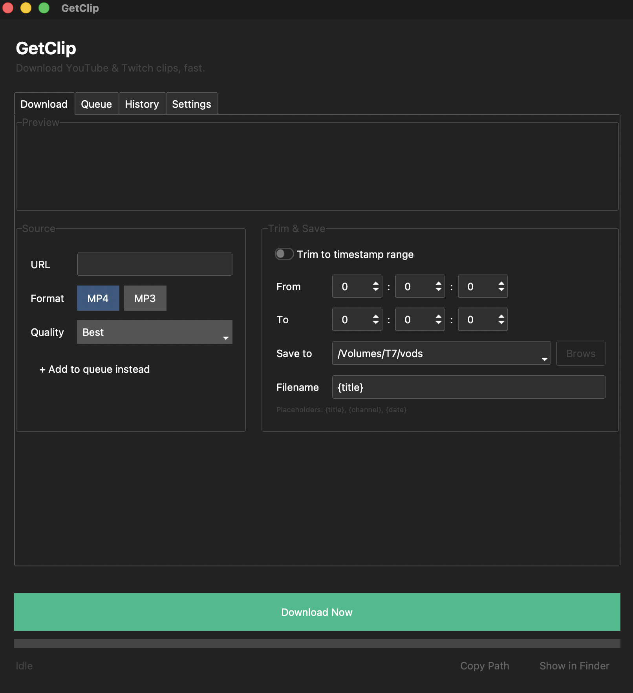

# GetClip

A simple desktop app for downloading YouTube videos and Twitch clips/VODs as MP4 or MP3 — with optional timestamp trimming, a live preview before you download, custom filename templates, and a batch queue for grabbing multiple videos at once.




## Download

Grab the latest macOS build from the [Releases page](https://github.com/GZPavlov23/getclip/releases) — unzip `GetClip.zip` and double-click `GetClip.app`. No Python or terminal required.

> Since this isn't signed with an Apple Developer certificate, the first time you open it you'll need to **right-click → Open → Open** to bypass Gatekeeper's warning.

There's no packaged Windows build published yet — see [Building for Windows](#building-for-windows) to build `GetClip.exe` yourself in the meantime.

## Features

- **YouTube videos and Twitch clips/VODs** — auto-detected from the pasted URL, with a contextual hint (e.g. trimming recommended for long VODs)
- **Live preview** — see the title, thumbnail, and duration before committing to a download
- **MP4 or MP3** output, with quality options for video
- **Timestamp trimming** — grab just the section you need, using precise H:M:S spinners
- **Custom filename templates** — save files as `{date}_{title}`, `{channel}_{title}`, or any combination
- **Recent folders** — quickly switch between your last few used save locations
- **Batch queue** — add several videos and download them one after another
- **Download history** — a searchable log of everything you've downloaded, with double-click to reveal in Finder/Explorer
- **Native notifications** — get notified when a download or queue finishes
- **Dark/light theme toggle**
- **Update checker** — see if a newer version is available, right from the Settings tab

## Running from source

If you'd rather run it with Python directly (e.g. to modify the code):

### Requirements
- Python 3.10+
- [ffmpeg](https://ffmpeg.org/download.html) installed and on your PATH

### Setup
```bash
git clone https://github.com/GZPavlov23/getclip.git
cd getclip
python3 -m venv venv
source venv/bin/activate
pip install -r requirements.txt
python3 main.py
```

### Building the app yourself
```bash
./build.sh
```
This produces `dist/GetClip.app`.

### Building for Windows
Run these on an actual Windows machine (PyInstaller can't cross-compile):
```powershell
git clone https://github.com/GZPavlov23/getclip.git
cd getclip
python -m venv venv
venv\Scripts\activate
pip install -r requirements.txt
pip install pyinstaller

REM optional: bundles ffmpeg into the .exe so users don't need it installed
python scripts\fetch_ffmpeg_windows.py

pyinstaller GetClip.win.spec
```
This produces `dist/GetClip.exe`. Without the ffmpeg step, the app still works but relies on ffmpeg being available on the end user's PATH.

### Running the tests
```bash
pip install -r requirements-dev.txt
python3 -m pytest
```

## Project structure

This project follows a simple three-layer architecture: